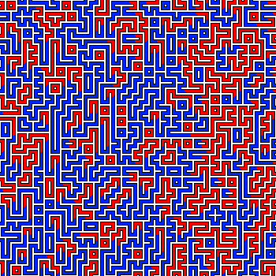
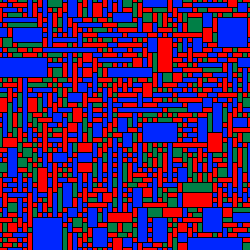
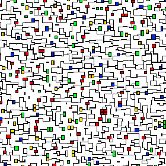
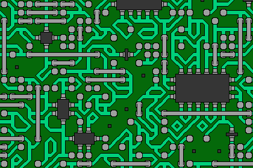
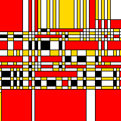

# Wave Function Collapse

Experimenting with the Wave Function Collapse algorithm in Python

## Installation

Clone this repo

Then do:

```
python -m venv venv
source venv/bin/activate
pip install -r requirements.txt
```

## Examples

```
python simple.py
```


```
python redblue.py
```



```
python rgb.py
```



```
python abstract.py
```



```
python circuit.py
```



```
python mondriaan.py
```



